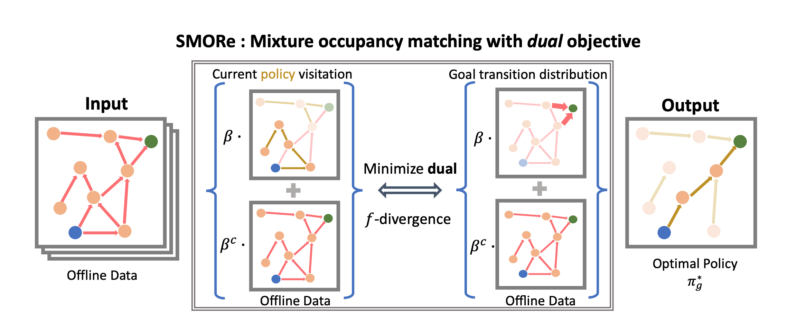

# SMORe

Official JAX code base for ICLR 2024 paper - SMORE: Score Models for Goal-Conditioned Reinforcement Learning

#### [[Project Page]](https://hari-sikchi.github.io/smore/) [[Paper]](https://arxiv.org/abs/2311.02013)

[Harshit Sikchi](https://hari-sikchi.github.io/)<sup>1</sup>, [Rohan Chitnis](https://rohanchitnis.com/)<sup>2</sup>, [Ahmed Touati](https://scholar.google.com/citations?user=D4LT5xAAAAAJ&hl=en)<sup>2</sup>, [Alborz Geramifard](https://sites.google.com/view/alborz-geramifard/home)<sup>2</sup>, [Amy Zhang](https://www.ece.utexas.edu/people/faculty/amy-zhang/)<sup>1,2</sup>, [Scott Niekum](https://www.cs.utexas.edu/~sniekum/)<sup>3</sup>,

<sup>1</sup>UT Austin

<sup>2</sup>Meta AI

<sup>3</sup>UMass Amherst

<p align="center">
  <br>
   <a href="https://arxiv.org/abs/2311.02013">Paper</a> <!--, &nbsp; <a href="">blog post</a> -->
</p>

## How to run the code

### Install dependencies

Create an empty conda environment and follow the commands below.

```bash
conda create -n smore python=3.9

conda install -c conda-forge cudnn

pip install --upgrade pip

# Install 1 of the below jax versions depending on your CUDA version
## 1. CUDA 12 installation
pip install --upgrade "jax[cuda12_pip]" -f https://storage.googleapis.com/jax-releases/jax_cuda_releases.html

## 2. CUDA 11 installation
pip install --upgrade "jax[cuda11_pip]" -f https://storage.googleapis.com/jax-releases/jax_cuda_releases.html


pip install -r requirements.txt

```


### Offline data

The offline datasets can be downloaded from the google drive link [WGCSL offline data](https://drive.google.com/drive/folders/1SIo3qFmMndz2DAnUpnCozP8CpG420ANb?usp=drive_link). This dataset is provided by prior work WGCSL. Extract the offline data in root-folder/offline_data/*


### Example training code

Locomotion
```bash
python train_offline_smore.py --double=True --env_name=halfcheetah-medium-v2 --config=configs/gcrl_config.py --eval_episodes=10 --eval_interval=5000  --beta=0.8 --loss_type=<'smore_stable'/'smore'> --exp_name=<exp_name>
```

Manipulation
```bash
python train_offline_smore.py --double=True --env_name=SawyerReach --config=configs/gcrl_config.py --eval_episodes=10 --eval_interval=5000  --beta=0.8 --loss_type=<'smore_stable'/'smore'> --exp_name=<exp_name>
```


## Acknowledgement and Reference

This code base builds upon the following code bases: [Extreme Q-learning](https://github.com/Div99/XQL) and [Implicit Q-Learning](https://github.com/ikostrikov/implicit_q_learning).
